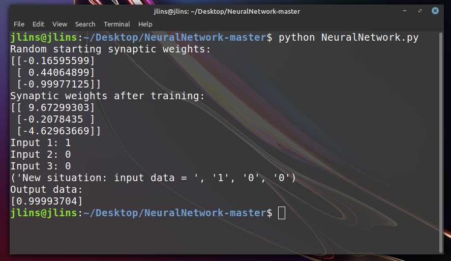

## NN From Scratch
# How to make a Neural Network from scratch in Python
 
In this workshop you will learn how to create a neural network in python that learns how to predict that if there is a `1` in the first column of a vector, that the output should be `1` and otherwise `zero`
 
To get started, we must import numpy
```python
import numpy as np
```
Next, we need to assign random weight values (We will tweak these values later with something called backpropagation)
```python
np.random.seed(1)
 
synaptic_weights = 2 * np.random.random((3, 1)) - 1
```
 
Next, we have to decide on an activation function. The top three are: `Sigmoid`, `TanH`, and `RelU`

The activation function is a crucial component in a neuron. All it does is determine if a neuron should fire or not. When a neuron fires, that just means that it's value will go on to the next layer.
 
But in this case we'll use a sigmoid function.


```python
def sigmoid(x):
    return 1 / (1 + np.exp(-x))
```
 
And we will always need the derivative of our activation function:
```python
def sigmoid_derivative(x):
    return x * (1 - x)
```
The derivative will be later multiplied by the error when calculating the adjustment values.

For those of you who are not fond calculus, all the "derivative" does essentially find the slope of any function.
 
Now let's create a neuron in the function which we'll call `base`
```python
def base(inputs):
    inputs = inputs.astype(float) 
    return sigmoid(np.dot(inputs, synaptic_weights))
```
 
# Train
This is the most important part in building a neural network, here, we will create the `train` function.
 
Within the `train` function, we will input a few arguments. These arguments include: training inputs, training outputs, and training iterations.
 
You might be asking, "Why do we include the outputs? Isn't that what the NN has to figure out itself?" 
 
The reason why we include the outputs is because we need the correct outputs in training so we can calculate the error.
 
 
```python
def train(training_inputs, training_outputs, training_iterations):
    global synaptic_weights
    for iteration in range(training_iterations):
        
        output = base(training_inputs)
        
        error = training_outputs - output
        
        adjustments = np.dot(training_inputs.T, error * sigmoid_derivative(output))
 
        synaptic_weights += adjustments
```
 
As you can see in the function above, `error = training_outputs - output ` calculates the error.
 
This line here, `adjustments = np.dot(training_inputs.T, error * sigmoid_derivative(output))` calculates the adjustments to the weights (The backpropagation I was talking about)
 
Which you can see change here: `synaptic_weights += adjustments`
 
 
# Training it
Now let's actually train our model!
 
In the following lines of code, I will create training inputs and transpose them.
 
```python
training_inputs = np.array([[0,0,1],
                            [1,1,1],
                            [1,0,1],
                            [0,1,1]])
 
training_outputs = np.array([[0,1,1,0]]).T
```
 
Then I will pass this through the train function:
```python
train(training_inputs, training_outputs, 10000)
```
 
# Get The Results!
 
We will prompt the user for inputs:
```python
 
A = str(input("Input 1: "))
B = str(input("Input 2: "))
C = str(input("Input 3: "))
```
 
And finally we will pass it through our network!!!
```python
base(np.array([A, B, C]))
```
 
```input 1: 1
input 2: 0
input 3: 0
```
output:
something close to 1
The neural network learns that if there is a 1 in the first column, that the output should be 1
 

 
 
View code here: [https://github.com/JohnLins/NeuralNetwork](https://github.com/JohnLins/NeuralNetwork)
Run code here: [https://repl.it/@JohnLins/NeuralNetwork](https://repl.it/@JohnLins/NeuralNetwork)
 
# Final code
```python
import numpy as np
 
np.random.seed(1)
 
synaptic_weights = 2 * np.random.random((3, 1)) - 1
 
def sigmoid(x):
    return 1 / (1 + np.exp(-x))
 
def sigmoid_derivative(x):
    return x * (1 - x)
 
 
def base(inputs):
    inputs = inputs.astype(float) 
    return sigmoid(np.dot(inputs, synaptic_weights))
 
def train(training_inputs, training_outputs, training_iterations):
    global synaptic_weights
    for iteration in range(training_iterations):
        
        output = base(training_inputs)
        
        error = training_outputs - output
        
        adjustments = np.dot(training_inputs.T, error * sigmoid_derivative(output))
 
        synaptic_weights += adjustments
 
 
print("Random starting synaptic weights: ")
print(synaptic_weights)
 
 
training_inputs = np.array([[0,0,1],
                            [1,1,1],
                            [1,0,1],
                            [0,1,1]])
 
training_outputs = np.array([[0,1,1,0]]).T
 
  
train(training_inputs, training_outputs, 10000)
 
 
print("Synaptic weights after training: ")
print(synaptic_weights)
 
A = str(input("Input 1: "))
B = str(input("Input 2: "))
C = str(input("Input 3: "))
    
print("New situation: input data = ", A, B, C)
print("Output data: ")
print(base(np.array([A, B, C])))
```


# Run
`cd /NeuralNetwork`
<br/>
`python NeuralNetwork.py`
